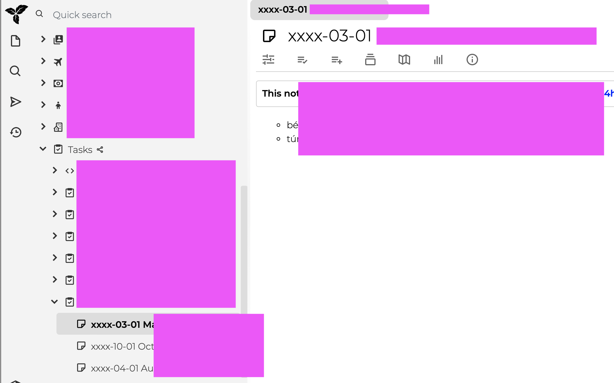

# trilium-xxxx-uk

Hobby project to learn more about Terraform and AWS

## Topic

[Trilium](https://github.com/zadam/trilium/releases) installation, using terraform, terraform cloud and EC2 instances. Secified subtree of notes are converted to task manager using daily-scheduled Lambda function.

## Project structure

[Base AMI generation](01_base-ami-generation/README.md)

[Lambda function's code](02_task-manager-lambda/README.md)

[Terraform](03_terraform/README.md)
